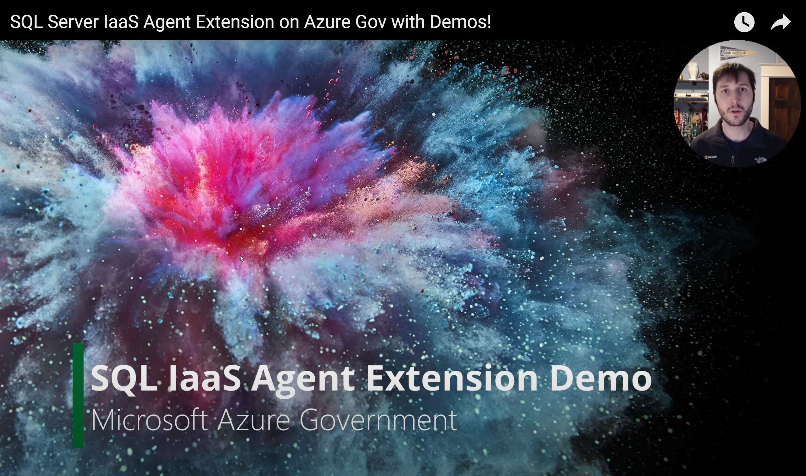

# SQL IaaS Agent Extension for Microsoft Azure Government 

This repository is to help provide guidance and scripts on how to bulk register SQL Server Virtual Machines in Azure with the Azure SQL IaaS Agent Extension in Azure Government. To see the registration in action you can view the [video](https://www.youtube.com/watch?v=qmB3ufHN9Kk) on registering your SQL VMs.

[](https://www.youtube.com/watch?v=qmB3ufHN9Kk)

The .psm1 script in this repository is the same one used in the video, but comes pre modified:
```
- [x] Modified to work from Azure Cloud Shell
- [x] Modified to log into Azure Government
```
### High Level List of Capabilities Enabled by SQL IaaS Agent Extension
Capability | Lightweight mode | Full Mode
------------ | ------------- | ------------
HA/Distaster Recovery License Type<br><sub>Take advantage of HA/DR</sub> | :heavy_check_mark: | :heavy_check_mark:
Flexible Licensing<br><sub>Switch Between PAYGO and AHB</sub> | :heavy_check_mark: | :heavy_check_mark:
Unified Management View<br><sub>Managed your SQL VM/PaaS Deloyments from one location</sub> | :heavy_check_mark: | :heavy_check_mark:
Automated Backup<br><sub>Easy backup with Point-in-Time Restore</sub> | :x: | :heavy_check_mark:
Automated Patching<br><sub>Free, Simple installation of Critical Updates (2008 R2+)</sub> | :x: | :heavy_check_mark:
Disk Scaling<br><sub>Resize Data and Log disks from the Azure Portal</sub> | :x: | :heavy_check_mark:
Simplified Always On HA<br><sub>Create Availability Groups with Azure CLI (GUI in Preview as of Oct 2020)</sub> | :x: | :heavy_check_mark:
Azure Key Vault Ingegration<br><sub>Configure Azure Key Vault for the SQL Server instance</sub> | :x: | :heavy_check_mark:
Add'l Integration with Azure<br><sub>Tighter integration with Azure Defender, Vulnerability Assessment and<br>Monitoring services</sub> | CY21 | CY21
